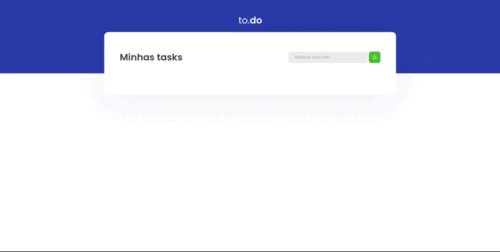

<!--==================== HERO  ====================-->
<h4 align="center">
  
</h4>

<!--==================== BADGES  ====================-->

  <!-- LICENSE -->
  
  <!-- LAST COMMIT -->
  
  <!-- STARS -->
  
  <!-- FORKS -->
  
  <!-- AUTHOR -->
  
  <!-- LANGUAGES -->
  
  <!-- REPO SIZE -->
    
  <!-- CONTRIBUTORS -->
    

<!--==================== TITLE  ====================-->

  <h1 align="center">
    Desafio 01 - Conceitos do React.js - Ignite - Trilha React.js
  </h1>
  
Deployed 
    <a href="https://ignite-react-desafio-01-conceitos-do-react.vercel.app/">here</a>
  

<!--==================== ABOUT THIS PROJECT  ====================-->

  <h2>💻 About</h2>
  
In this challenge, you must create an application to train what you have learned so far in ReactJS
This will be an application where your main objective is a small to-do application, to train a little more about state manipulation in React.
  

<!--==================== ABOUT THIS IGNITE  ====================-->

  <h2>🚀 What is the<a href="https://rocketseat.com.br/ignite"> Ignite</a>?</h2>
  
Program to accelerate your career as a Dev. Created to prepare you for the     market, developing technical and behavioral skills. Evolve and certify in Elixir, Flutter, React.js or React Native.
  

<!-- ==================== FEATURES  ====================-->

  <h2>📋 Features</h2>
  <ul>
    <li>[x] Add a new task</li>
    <li>[x] Remove a task</li>
    <li>[x] Mark and unmark a task as complete</li>
  </ul>

<!-- ==================== LAYOUT  ====================-->

  <!-- <h2>🎨 Layout</h4>
  
O layout da aplicação está disponível no Figma:

  

    
  

  
Design feito por 
    <a href="https://dribbble.com/rebeccagonzalez">Rebecca Gonzalez</a>
  
 -->
  <h2>💻 Web/📱Mobile</h2>
  <h4 align="center">
    
  </h4>

<!--==================== CHALLENGES  ====================-->

  <h4>⚔️  Challenges to improve the application</h4>
    <ul>
      <li>[x] Create documentation
      <li>[x] Example Gif</li>
      <li>[x] Awesome Readme</li>
      <li>[x] Technologies used</li>
      <li>[x] Project Setup</li>
      <li>[x] Features</li>
      <li>[ ] Add favicon</li>
      <li>[ ] Mobile First</li>
    </ul>

<!--==================== TECH STACK  ====================-->

  <h2>🚀 Tech Stack</h2>
  
The following tools were used in the construction of the project:

  <ul>
    <li><strong><a href="https://pt-br.reactjs.org/">React</a></strong></li>
    <li><strong><a href="https://www.typescriptlang.org/">TypeScript</a></strong></li>
    <li><strong><a href="https://sass-lang.com/">Sass</a></strong></li>
    <li><strong><a href="https://webpack.js.org/">webpack</a></strong></li>
    <li><strong><a href="https://babeljs.io/">Babel</a></strong></li>
    <li><strong><a href="https://react-icons.github.io/react-icons/">React Icons</a></strong></li>
    <li><strong><a href="https://jestjs.io/pt-BR/">Jest</a></strong></li>
    <li><strong><a href="https://testing-library.com/docs/react-testing-library/intro/">React Testing Library</a></strong></li>
  </ul>
  

  <h2>How to run the project</h2>
  <h3>Prerequisites</h3>
  
Before starting, you will need to have the following tools installed on your     machine:
    <a href="https://git-scm.com">Git</a>, 
    <a href="https://nodejs.org/en/">Node.js</a>.
  Have an editor to work with the code like 
    <a href="https://code.visualstudio.com/">VSCode</a>
  

<!--==================== CLONING THE REPOSITORY ====================-->

  <h2>👯 Cloning the repository</h2>
<pre><code># Clone this repository
$ git clone https://github.com/marcelo-rafael/ignite-react-desafio-01-conceitos-do-react

# Access the project folder in the terminal
$ cd ignite-react-desafio-01-conceitos-do-react
</code></pre>

<h3>Running the Application</h3>
<pre><code># install dependencies
$ yarn or npm install

# Run Application in Development
$ yarn dev or npm run start

# The application will open at port: 8080 - access http://localhost:8080
</code></pre>

<!--==================== COMMANDS ====================-->

  <h2>🔎 Commands</h2>
  <ul>
    <li><code>dev</code>: runs your application on <code>localhost:8080</code></li>
    <li><code>build</code>: creates the production build version</li>
  </ul>

<!--==================== CONTRIBUTE TO THE PROJECT ====================-->

  <h2>💪 How to contribute to the project</h2>
  <ol>
    <li>🍴 Fork the project.</li>
    <li>👯 Clone this repository to your machine.</li>
    <li>🎋 Create a new branch with your changes: <code>git checkout -b my-feature</code></li>
    <li>✅ Save the changes and create a commit message telling you what you've done: <code>git commit -m "feature: My new feature"</code></li>
    <li>📌 Submit your changes: <code>git push origin my-feature</code></li>
    <li>🔃 Create a new pull request</li>
  </ol>
  
Once your pull request has been merged, you can delete <code>your-feature</code>

  <blockquote>
    
If you have any questions, check out this 
      <a href="https://github.com/firstcontributions/first-contributions">GitHub      Contribution Guide
      </a>
    

  </blockquote>

<!--==================== AUTHOR ====================-->

  <h2>🤓 Author</h2>
  

    
  

  

    
    
    
  

<!--==================== LICENSE ====================-->

  <h2>📝 LICENSE</h2>
  
This repository is licensed under the <strong>MIT LICENSE</strong>. For more detailed information, read the <a href="./LICENSE">LICENSE</a> file contained in this repository.

  <h3 align="center">
  Made with ❤️ by <a href="https://www.linkedin.com/in/marcelo-rafael-goncalves/">Marcelo Rafael Gonçalves 💜🚀</a>
  </h3>

